# Info: die letzten drei Änderungen (7.8 → 7.9.1)

Testbuild-Linie auf Branch `gregor-erweiterung` (Test-App `at.gregor.layermaxxing.gerfried`, nur Testserver).
Alle Bilder sind echte gerenderte App-Screens (Robolectric/Compose, synthetische Testdaten – keine echten Profile oder Daten).

| Version | Commit | Thema |
|---|---|---|
| 7.8-klare-wege | `1037131` | Navigation & Theme: schneller raus aus der Insel, neutrale Screens |
| 7.9-neue-icons | `0f038b2` | Icon-Inventar + einheitliches Linien-Icon-Set |
| 7.9.1-icons-komplett | `3a42a77` | Rest-Icons: Briefe-Raum, Vorschau, Status, Raum-Köpfe |

---

## 1 · 7.8 „Klare Wege“ – Navigation & Theme

**Ziel:** Jede wichtige Funktion in beiden Modi schnell erreichbar, im Inselmodus schnell zurück zum Hauptmenü, ein einheitlicher Look.

**Schneller raus aus der Insel**
- Inselleiste fest: **Karte · Meine Insel · Hafen · Chats** – „Chats“ mit Ungelesen-Zahl, 1 Tap ins Hauptmenü.
- Lange auf „Karte“ drücken → Chats.
- Doppelter „← Inseln“-Knopf in den Einstellungen entfernt.

**Wichtiges präsenter**
- Chatliste: Chips Gruppen / Themen / Wörterbuch / Inseln immer sichtbar (bei 0 als „+ Gruppe“, „+ Thema“).
- „Mehr“ zeigt Briefe, Punkte und Wörterbuch auch im Inselmodus.
- Punkte- und Brief-Pille auf der Karte immer da, bei 0 gedämpft.
- Freundschaftsregeln direkt im Chat-Menü ⋮ (2 statt 3 Taps).
- Nur noch **ein** Quest-Formular; „Gruppe erstellen“ nur im Gruppen-Screen.

**Neutrale Screens**
- Neue **Freund-Seite** (Name im Chat-Kopf antippen): Spitzname, Quests, Briefe, Themen, Regeln – ohne Insel.
- Insel-exklusiv bleiben bewusst: Status „Ich bin hier“, Bauen, Deko.

**Theme**
- Alle Nicht-Insel-Screens im Hafenpost-Look (Creme + Teal/Navy): kein Lavendel, kein reines Weiß, kein Dunkelbraun.
- Material You nur noch optional unter Darstellung.
- Alte Dorf-Karte (`BuildingCard`) entfernt.
- Theme-Check: vorher 18 ok / 18 teils / 6 nein → jetzt **39 ok / 4 teils / 0 nein**.

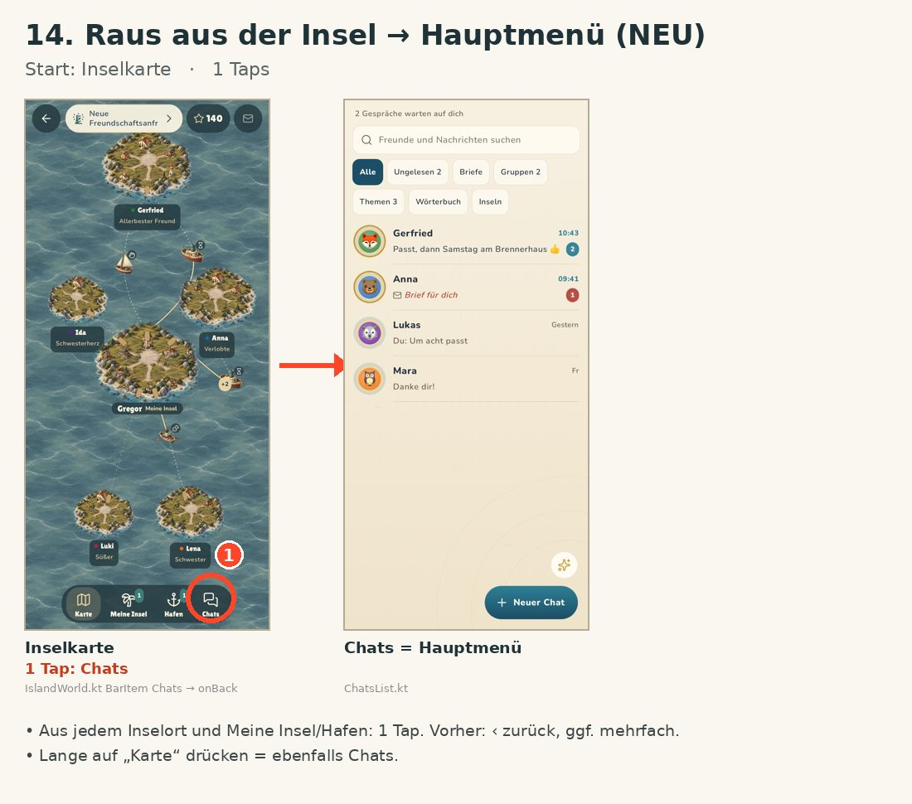
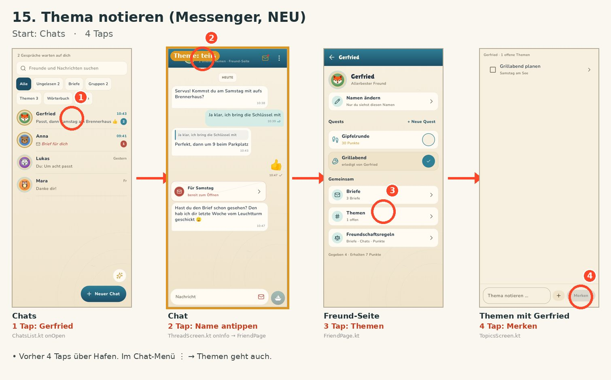
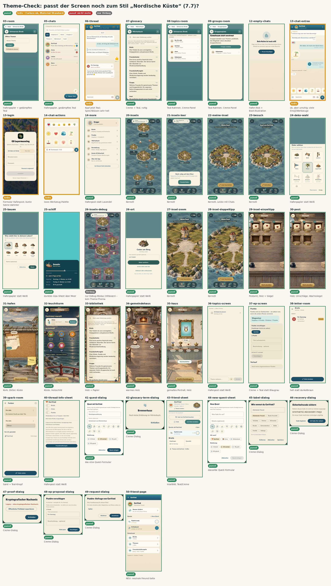
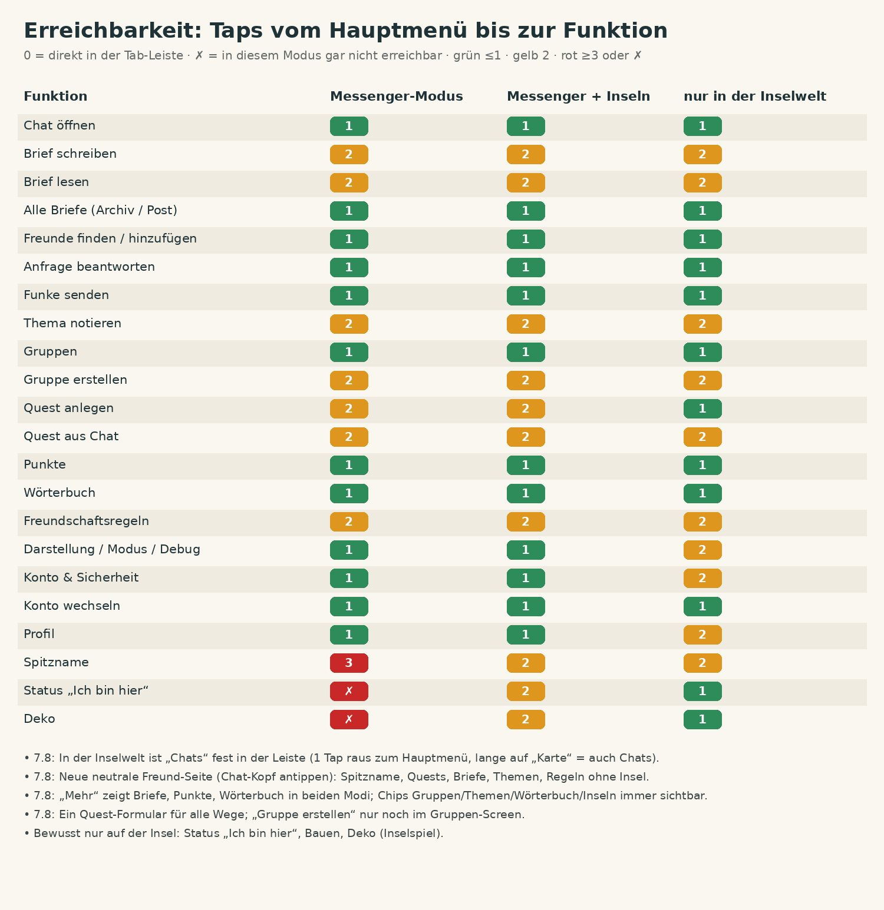
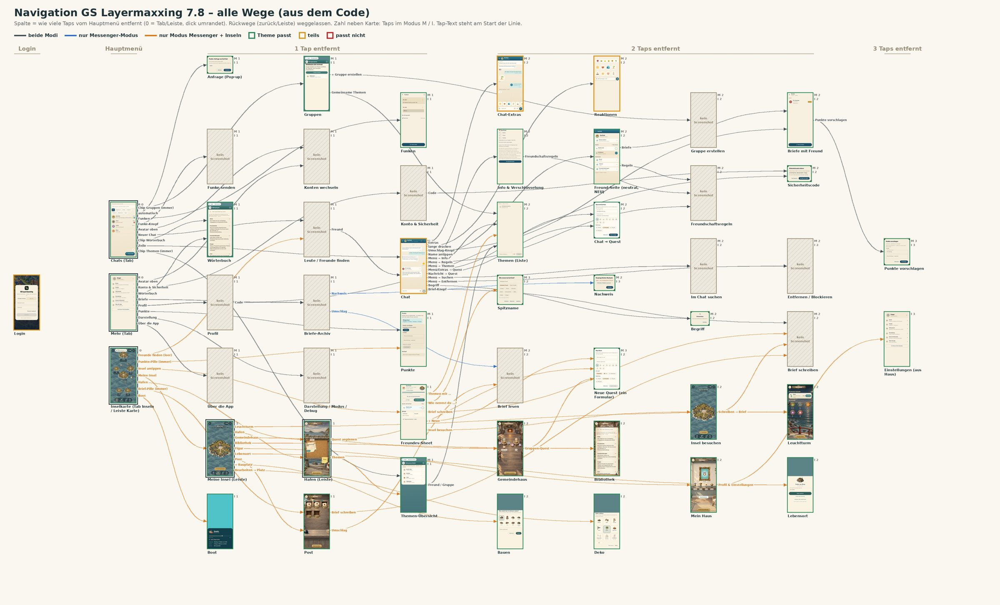
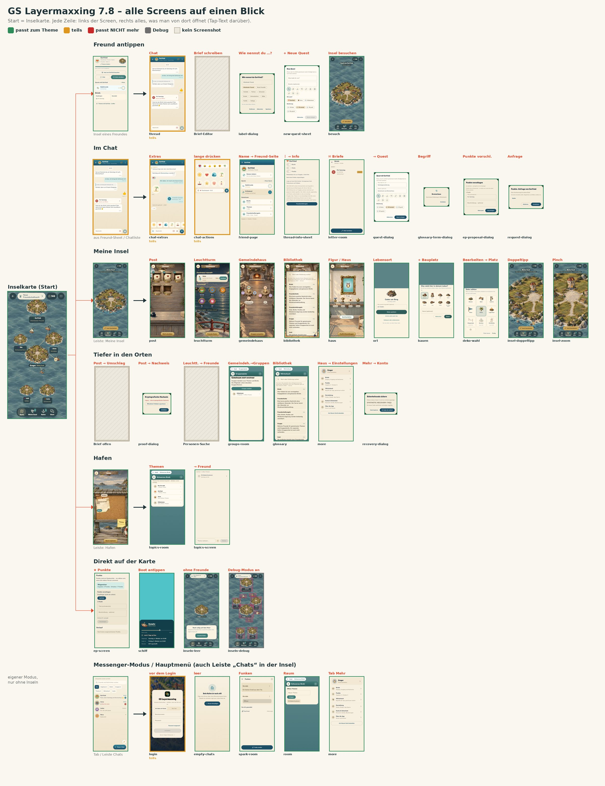

---

## 2 · 7.9 „Neue Icons“ – Inventar + Redesign

**Vorher:** Mix aus bunten Emoji (💬 🏝 ⚓ 📌 🗑 🔐), Unicode-Zeichen (◷ ▣ ☝ ✓✓ ⧉ ⌕ ⓘ) und gemalten Bildchen.

**Jetzt:** ein Set dünner Linien-Icons (Lucide, ISC-Lizenz), gleicher Strich, eingefärbt in Teal/Creme.
- 85 VectorDrawables `ico_*`, generiert von [`docs/icons/build_icons.py`](../icons/build_icons.py) – Icon tauschen = eine Zeile.
- Gemeinsame Compose-Komponente `AppIcon` (`AppIcons.kt`).
- Umgestellt: Tabs, Inselleiste, Pillen, Mehr-Menü, Chat-Menü ⋮, Nachrichten-Menü, Brief-Modi/Siegel, Bootszeiten, Quest-Arten, Freund-Seite.
- Bootszeiten vereinfacht: Anker (wartet) · Glocke (angekommen) · Sanduhr (heute) · Kalender (Tage+).
- **Bleibt bewusst:** Tier-Avatare, Reaktionen, Sticker, die gemalte Inselwelt.
- Volle Liste alt → neu: [`docs/icons/icon-inventar.md`](../icons/icon-inventar.md)

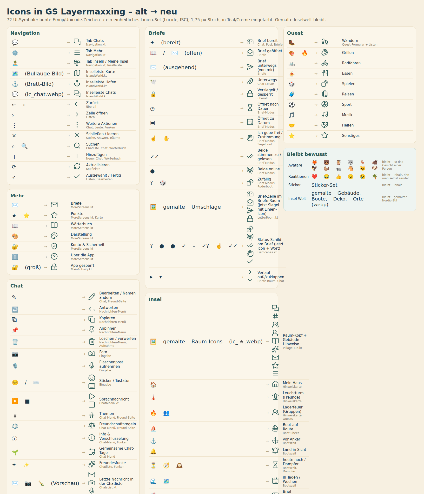
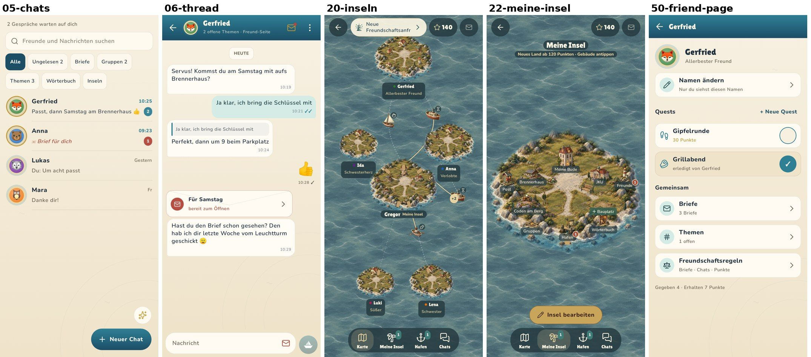
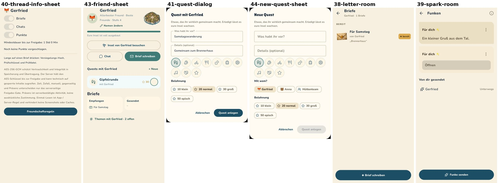

---

## 3 · 7.9.1 „Icons komplett“ – die Reste

Nach Feedback: im Briefe-Raum und in der Chatlisten-Vorschau waren noch alte Symbole.
- **Briefe-Raum:** farbiges Siegel mit Linien-Icon statt gemalter Umschläge (rot = bereit, gold = wartet auf dich, teal = versiegelt, grau = erledigt).
- **Status-Schilder:** statt `?`, `● ●`, `☝`, `✓✓` jetzt Icon + Wort („Zufall“, „beide online“, „Freigabe“, „gelesen“ …).
- **Chatliste:** letzte Nachricht mit Linien-Icon (Brief / Foto / Flaschenpost / Sticker / gelöscht) statt ✉ 📷 🍾.
- **Chat:** Lesehaken, Verlauf-Pfeil, Anhang/Details im Brief-Formular, „Brief schreiben“ mit Stift.
- **Raum-Köpfe & Gebäude-Hinweise** (Wörterbuch, Schwarzes Brett, Gruppen …): Linien-Icons; 8 alte gemalte `ic_*`-Bilder gelöscht.
- Kleinkram: Leer-Hinweise, Konto-Auswahl, Benachrichtigungs-Haken, Quest-Häkchen, „Für dich ✨“ → „Für dich“.

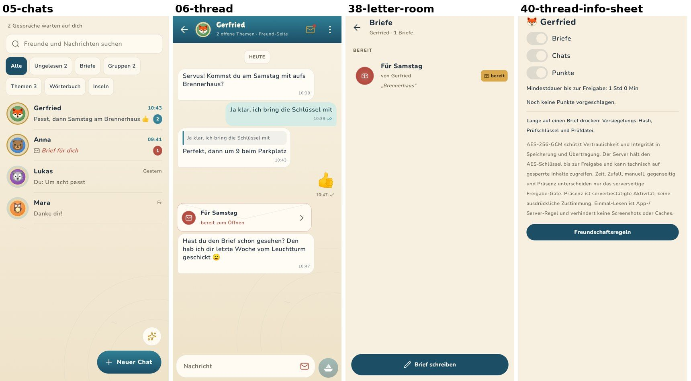
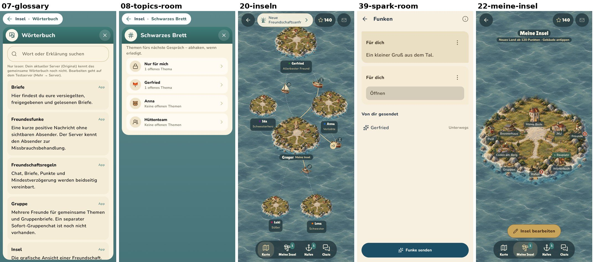

---

## Verifikation
- Jede Version: `./gradlew testDebugUnitTest lintDebug assembleDebug` → **BUILD SUCCESSFUL**.
- Screens jeweils neu gerendert und visuell geprüft.

## Offen
- Zurück aus einem Inselort führt zur letzten Ansicht statt direkt zur Karte.
- Spitzname im Messenger: 3 Taps (Ziel war ≤ 2).
- 4 Screens nur „teils“ im Theme (Chat-Blasen, Extras-Leiste, Reaktionen, Login-Szene).
- Senden-Knopf im Chat ist noch das gezeichnete Papierschiff (Marke vs. Linien-Icon – Entscheidung offen).

## Weitere Doku
- Klickpfade & Atlas: [`docs/clickpath-opus/`](../clickpath-opus/) (inkl. `UMBAU-ANWEISUNGEN.md`)
- Icons: [`docs/icons/`](../icons/)
